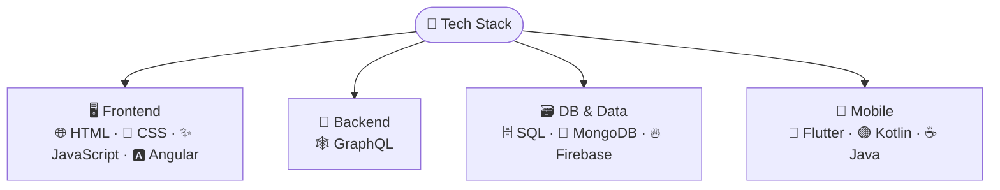
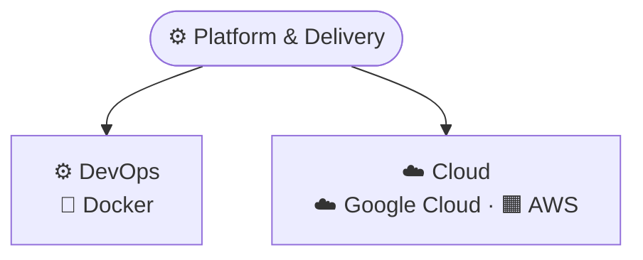
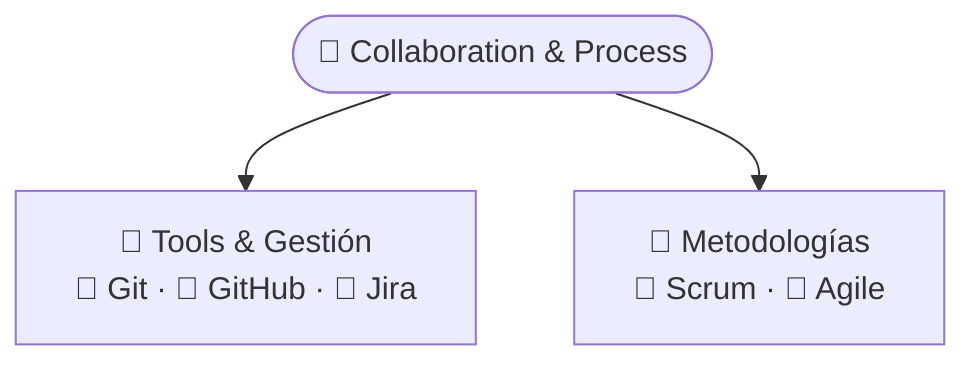
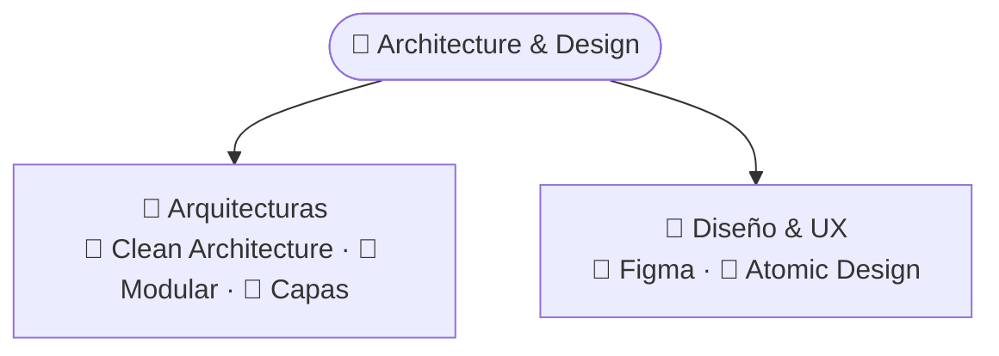
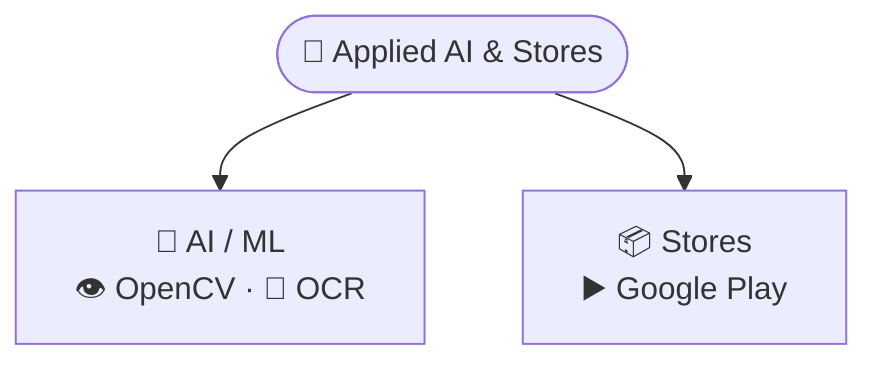
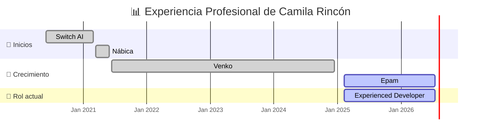

<h1 align="center">Hola 👋, soy María Camila Rincón Ayala</h1>
<h3 align="center">🇨🇴 Mobile Developer | Frontend Developer </h3>

  
  
  

  

---

## 🧾 Sobre mí

Ingeniera de Sistemas con 5 años de experiencia en desarrollo multiplataforma (Frontend y Mobile). Me destaco por mi rápido aprendizaje, adaptabilidad y fuerte orientación al detalle en el diseño UI/UX utilizando Flutter, Angular y Android. Acostumbrada a colaborar eficazmente en equipos ágiles (Scrum), mi enfoque está en entregar resultados técnicos de alto impacto, asegurar una experiencia de usuario óptima y aportar valor a los proyecto de la empresa.

- 📍 Floridablanca, Colombia  
- 🎯 Especializado en Flutter, UX/UI, Kotlin 

---

### 🧰 Tech Stack

---

## 💼 Experiencia Laboral

---

## 📫 Contacto

---
